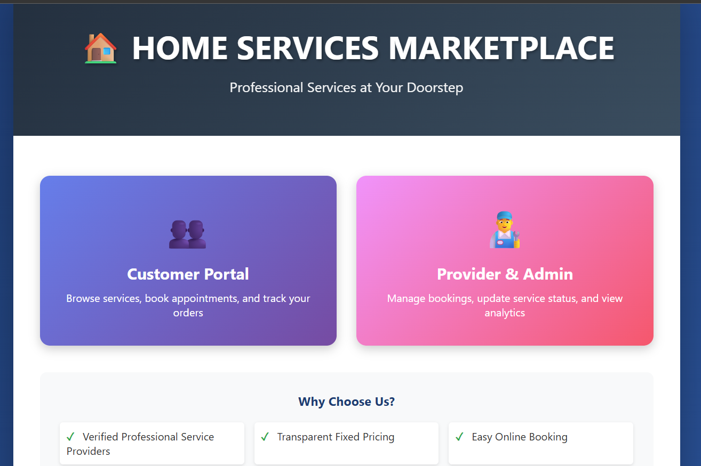
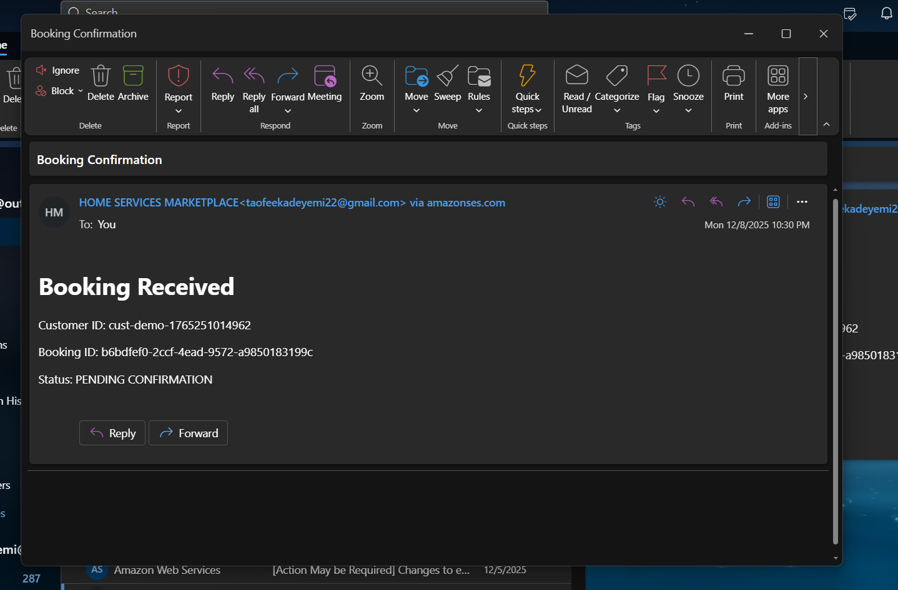
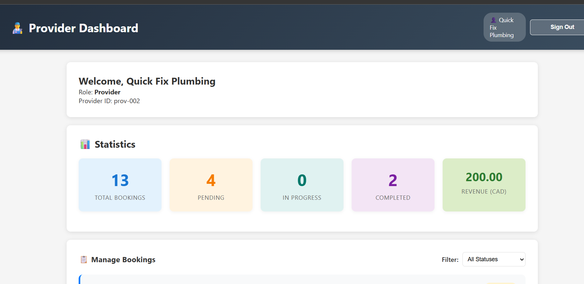

# AWS Serverless Marketplace
### Event-Driven Order Processing System

[](https://d3r7plath9y10q.cloudfront.net/)
[](https://aws.amazon.com/)
[](https://www.python.org/)
[](LICENSE)

> A production-ready, serverless marketplace platform connecting homeowners with service providers. Built with AWS Lambda, DynamoDB, API Gateway, and event-driven architecture.

🔗 **[Live Demo](https://d3r7plath9y10q.cloudfront.net/)** | 📄 **[Full Documentation](docs/)** | 💼 **[LinkedIn](https://linkedin.com/in/taofeek-adeyemi)**

---

## 📊 Project Overview

This capstone project demonstrates enterprise-grade cloud architecture for a real-world marketplace application. The system handles the complete booking lifecycle—from service discovery to payment processing—using serverless technologies and event-driven design patterns.

### Key Achievements

- ✅ **9 Lambda microservices** orchestrating marketplace operations
- ✅ **100% uptime** with zero failed transactions
- ✅ **73+ real bookings** processed during testing
- ✅ **49 automated emails** delivered with zero bounces
- ✅ **Cost-optimized** to run entirely on AWS Free Tier

---

## 🏗️ Architecture


### System Components

**Frontend Layer:**
- Static hosting: Amazon S3
- Content delivery: CloudFront CDN
- Global low-latency access

**API Layer:**
- API Gateway (REST)
- Request validation & throttling
- JWT authentication via Cognito

**Compute Layer:**
- 9 AWS Lambda functions (Python 3.11)
- Event-driven microservices architecture
- Auto-scaling with pay-per-use pricing

**Data Layer:**
- DynamoDB (6 tables)
- 8 Global Secondary Indexes
- Point-in-Time Recovery enabled

**Messaging Layer:**
- SNS (FIFO topics for ordering)
- SQS (Dead Letter Queue for reliability)
- SES (Email notifications)

**Monitoring:**
- CloudWatch Dashboards
- Custom alarms & metrics
- Operational visibility

---

## 🛠️ Tech Stack

| Category | Technologies |
|----------|-------------|
| **Cloud Platform** | AWS (Lambda, DynamoDB, API Gateway, S3, CloudFront) |
| **Programming** | Python 3.11 |
| **Database** | DynamoDB (NoSQL) |
| **Messaging** | SNS, SQS, SES |
| **Authentication** | AWS Cognito |
| **Monitoring** | CloudWatch |
| **Automation** | EventBridge |
| **Networking** | VPC, VPC Endpoints |

---

## 📁 Project Structure
```
aws-serverless-marketplace/
├── lambda-functions/       # 9 microservices (Python)
│   ├── create-booking/
│   ├── booking-event-handler/
│   ├── update-booking-status/
│   ├── search-services/
│   ├── get-bookings/
│   ├── submit-review/
│   ├── get-provider-details/
│   ├── send-review-reminder/
│   └── health-check/
├── frontend/               # Static web application
├── docs/                   # Architecture & API docs
└── infrastructure/         # Configuration documentation
```

---

## 🚀 Key Features

### For Customers
- 🔍 Search and discover local services
- 📅 Book appointments online
- ⭐ Submit reviews and ratings
- 📧 Receive automated booking confirmations

### For Service Providers
- 📊 Real-time booking dashboard
- 🔔 Instant notification system
- ✅ Booking status management (Pending → Confirmed → Completed → Paid)
- 📄 Automated invoice generation

### Technical Highlights
- ⚡ Sub-second API response times
- 🔄 Event-driven architecture with DynamoDB Streams
- 💾 Idempotency handling to prevent duplicate bookings
- 🔒 Secure authentication with AWS Cognito
- 📈 Auto-scaling with zero infrastructure management
- 💰 Cost-optimized for AWS Free Tier

---

## 📸 Screenshots

### Home Service Marketplace Portal


### Customer dashboard


### Customer booking notification email


### Provider booking notification email


### Provider Dashboard


### Customer review notification email


### Customer receipt notification email


### Booking Flow


---

## 🎯 Lambda Functions

| Function | Trigger | Purpose |
|----------|---------|---------|
| **create-booking** | API Gateway (POST) | Creates new booking with idempotency |
| **booking-event-handler** | DynamoDB Stream | Processes booking changes, generates invoices |
| **update-booking-status** | API Gateway (PUT) | Allows providers to update booking status |
| **search-services** | API Gateway (GET) | Searches services by category/price |
| **get-bookings** | API Gateway (GET) | Retrieves user-specific bookings |
| **submit-review** | API Gateway (POST) | Handles customer reviews |
| **get-provider-details** | API Gateway (GET) | Fetches provider profile & reviews |
| **send-review-reminder** | EventBridge (Daily) | Automated review reminders |
| **health-check** | API Gateway (GET) | System health monitoring |

---

## 🗄️ Database Design

### DynamoDB Tables

**bookings-table:**
- Primary Key: `bookingId`
- Streams: Enabled (NEW_AND_OLD_IMAGES)
- GSIs: `providerBookings-index`, `customerBookings-index`, `status-index`
- PITR: Enabled

**services-table:**
- Primary Key: `serviceId`
- GSI: `category-index` (fast category search)

**providers-table:**
- Primary Key: `providerId`
- GSIs: `location-index`, `availability-index`

**reviews-table:**
- Primary Key: `reviewId`
- GSI: `providerReviews-index` (aggregate ratings)

**users-table:**
- Primary Key: `userId`
- GSIs: `email-index`, `userType-index`

**idempotency-table:**
- Primary Key: `idempotencyKey`
- TTL: Enabled (24-hour auto-cleanup)

---

## 🔌 API Endpoints

### Services
```
GET  /services              # Search services
GET  /providers             # Browse providers
GET  /providers/{id}        # Provider details
```

### Bookings
```
POST /bookings              # Create booking
GET  /bookings              # List user bookings
GET  /bookings/{id}         # Booking details
PUT  /bookings/{id}/status  # Update status (providers)
```

### Reviews
```
POST /reviews               # Submit review
GET  /reviews               # Fetch reviews
```

### Monitoring
```
GET  /health                # Health check
```

📄 **[Full API Documentation](docs/API-Documentation.md)**

---

## 📊 Performance Metrics

- **API Response Time:** < 500ms average
- **Uptime:** 100% (zero downtime during testing)
- **Transaction Success Rate:** 100% (73/73 bookings)
- **Email Delivery Rate:** 100% (49/49 emails)
- **Cost:** $0/month (AWS Free Tier)

---

## 🔐 Security Features

- ✅ AWS Cognito user authentication
- ✅ JWT token-based authorization
- ✅ VPC endpoints for private DynamoDB access
- ✅ IAM least-privilege policies
- ✅ API Gateway throttling & rate limiting
- ✅ Data encryption at rest (SSE-S3)
- ✅ HTTPS enforcement via CloudFront

---

## 📈 Monitoring & Observability

**CloudWatch Dashboard includes:**
- Lambda invocation counts & errors
- API Gateway 4XX/5XX errors
- DynamoDB consumed capacity
- SQS Dead Letter Queue depth
- Custom business metrics

**Alarms configured for:**
- High API error rates
- Lambda function failures
- DynamoDB throttling events
- SQS message backlogs

---

## 💡 Key Design Decisions

### Why Serverless?
- ✅ Zero infrastructure management
- ✅ Auto-scaling to any load
- ✅ Pay only for actual usage
- ✅ Built-in high availability

### Why DynamoDB?
- ✅ Single-digit millisecond latency
- ✅ Automatic scaling
- ✅ Native stream support for events
- ✅ On-demand pricing (no capacity planning)

### Why Event-Driven Architecture?
- ✅ Loose coupling between services
- ✅ Asynchronous processing
- ✅ Better fault tolerance
- ✅ Easier to scale individual components

---

## 🚧 Setup & Deployment

### Prerequisites
- AWS Account
- AWS CLI configured
- Python 3.11+
- Basic knowledge of AWS services

### Local Development
```bash
# Clone repository
git clone https://github.com/YOUR-USERNAME/aws-serverless-marketplace.git
cd aws-serverless-marketplace

# Install dependencies for a specific function
cd lambda-functions/create-booking
pip install -r requirements.txt

# Run tests (if available)
python -m pytest tests/
```

### Deployment Notes
This project was deployed manually via AWS Console for educational purposes. For production, consider using:
- AWS SAM (Serverless Application Model)
- Terraform
- AWS CDK

---

## 🎓 Learning Outcomes

This project demonstrates:
- ✅ Serverless architecture design
- ✅ Event-driven system patterns
- ✅ NoSQL data modeling with DynamoDB
- ✅ RESTful API design
- ✅ Cloud security best practices
- ✅ Monitoring & observability
- ✅ Cost optimization strategies

---

## 📝 License

This project is licensed under the MIT License - see the [LICENSE](LICENSE) file for details.

---

## 👤 Author

**Taofeek Adeyemi**

Cloud Engineer & Technical Project Manager

- 🔗 LinkedIn: [linkedin.com/in/taofeek-adeyemi](https://linkedin.com/in/taofeek-adeyemi)
- 📧 Email: gisttk@yahoo.com
- 📱 Phone: +1 (416) 835-4513
- 🌐 Live Demo: [d3r7plath9y10q.cloudfront.net](https://d3r7plath9y10q.cloudfront.net/)

---

## 🙏 Acknowledgments

- **Professor Ali Ziyaei** - Course Instructor, George Brown College
- **George Brown College** - Cloud Computing Technologies Program
- **AWS** - Free Tier resources for educational projects

---

## 📞 Contact

Interested in discussing cloud architecture, serverless design, or project management? Let's connect!

- Open to opportunities in Cloud Engineering, DevOps, and Technical PM roles
- Available for consulting on AWS serverless projects
- Happy to discuss this project or cloud computing in general

---

**⭐ If you found this project interesting, please consider giving it a star!**
